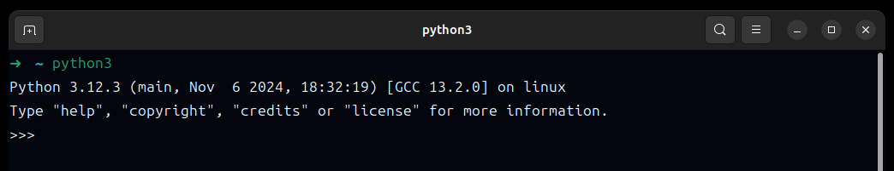

# python-programming-language
Python Programming Language

## Overview
Python is a clear and powerful object-oriented programming language, comparable to Perl, Ruby, Scheme, or Java.

### Some of Python's notable features:
* Uses an elegant syntax, making the programs you write easier to read.
* Is an easy-to-use language that makes it simple to get your program working. This makes Python ideal for prototype development and other ad-hoc programming tasks, without compromising maintainability.
* Comes with a large standard library that supports many common programming tasks such as connecting to web servers, searching text with regular expressions, reading and modifying files.
* Python's interactive mode makes it easy to test short snippets of code. There's also a bundled development environment called IDLE.
* Is easily extended by adding new modules implemented in a compiled language such as C or C++.
* Can also be embedded into an application to provide a programmable interface.
* Runs anywhere, including `Mac OS X`, `Windows`, `Linux`, and `Unix`, with unofficial builds also available for `Android` and `iOS`.
* Is free software in two senses. It doesn't cost anything to download or use Python, or to include it in your application. Python can also be freely modified and re-distributed because while the language is copyrighted it's available under an open-source license.

### Some programming-language features of Python are:
* A variety of basic data types are available: numbers (floating point, complex, and unlimited-length long integers), strings (both ASCII and Unicode), lists, and dictionaries.
* Python supports object-oriented programming with classes and multiple inheritances.
* Code can be grouped into modules and packages.
* The language supports raising and catching exceptions, resulting in cleaner error handling.
* Data types are strongly and dynamically typed. Mixing incompatible types (e.g. attempting to add a string and a number) causes an exception to be raised, so errors are caught sooner.
* Python contains advanced programming features such as generators and list comprehensions.
* Python's automatic memory management frees you from having to manually allocate and free memory in your code.

## Downloading Python
* install the Python 3 interpreter on your computer. This is the program that reads Python programs and carries out their instructions; you need it before you can do any Python programming. Mac and Linux distributions may include an outdated version of Python (Python 2), but you should install an updated one (Python 3).*

On many systems Python comes pre-installed, you can try running the python command to start the Python interpreter to check and see if it is already installed. On windows you can try the py command which is a launcher which is more likely to work. If it is installed you will see a response which will include the version number, for example:

 *image 1*

If you don't see this, you will need to install Python on your system.

If the version number is Python 2.x.y (where x and y are any number) you are using Python 2 which is no longer supported and is not a good choice for development. You can try running python3 to see if there is also a Python 3.x.y version installed, if not you'll want to install the latest version of Python.

If you do not have Python installed or need a newer version you can go to:

[](https://www.python.org/downloads/) *image 2*

Below are some system specific notes to keep in mind.

* `Linux`

    On most Linux distributions Python comes pre-installed and/or available via the distribution's package managers. Below are some common examples, but refer to your specific distribution's documentation and package list to get the most up to date instructions.

    If you'd like to download and build Python from source (or your distribution's package manager does not include a version of Python you need) you can download a source tarball from the general download page: https://www.python.org/downloads/
    
    *Debian or Ubuntu*
    ```bash
        apt-get install python3 python3-dev
    ```
## Learning Python
### Introduction

#### Why learn Python?
Since you’re here, you probably know why, but let’s quickly review Python’s advantages!

Python is one of the world’s most used and most popular programming languages. It’s powerful, versatile, and easy to learn. Python is widely used in various applications, some notable ones:

* Web development
* Data Science
* Data analysis
* Machine learning
* Artificial Intelligence (AI)
* Scripting and tooling

Many people say that Python comes with batteries included. It’s a fun way to state that it includes a comprehensive base library. In addition, because so many people use Python, hundreds of thousands of high-quality libraries and frameworks exist to get things done quickly and without hassle. You can do a lot with a little bit of Python code!

Learning Python is a no-brainer, and I promise you will be up and running quickly with this Python tutorial. Regardless of your future in IT, it will be a helpful tool to have in your toolbox!

#### Python history 
Let’s start by defining Python more precisely. Python is a computer programming language. Or, in other words, a vocabulary and set of grammatical rules for instructing a computer to perform tasks. Its original creator, Guido van Rossum, named it after the BBC television show ‘Monty Python’s Flying Circus.’ Hence, you’ll find that Python books, code examples, and documentation sometimes contain references to this television show.

In 1987, Guido worked on a large distributed operating system at the CWI, a national research institute for mathematics and computer science in the Netherlands. Within that project, he had some freedom to work on side projects. With the knowledge and experience he had built up in the years before, working on a computer language called ABC, he started writing the Python programming language.

Python is easy to learn, and it’s designed around a set of clearly defined principles (the Zen of Python) that encourage Python core developers to make a language that is unambiguous and easy to use.

### Install Python
#### Installation on MacOS
On most versions of MacOS before Catalina, a distribution of Python is already included. Unfortunately, it’s almost certainly an old version, Python 2.7. Luckily, there are two ways to easily install Python 3 on a Mac.

##### Homebrew
First and foremost, I recommend looking into Homebrew. It allows you to install almost anything easily. The added benefits:

* Homebrew packages are usually very up-to-date.
* It’s also easy to upgrade to newer versions later on.

However, you must be comfortable using a command-line shell to use Homebrew. If that’s entirely new for you, I recommend the following option for now: using the official installer.

If you choose to install Homebrew, installing Python on MacOS is as easy as:
```sh
$ brew install python
```
##### Official installer
Alternatively, you can download an installer from the Python download website. It’s easy and works like the installation of any other MacOS software program. The downside to this approach is that you won’t get automatic updates. Just like with Windows, you should ensure that Python is added to your system’s PATH.

#### Install Python on Linux
There are several ways to install Python on Linux, that is if you need to install it at all!

##### Check what’s installed first
Most Linux distributions include Python. Many will include both Python 2 and Python 3.

If you enter python --version on the command line, you’ll see the version number. It’s probably version 2.7:
```sh
$ python --version
Python 2.7.16
```
Unfortunately, you don’t want Python 2, but some OS’es still ship with it.

Now try python3 --version. If you get a “command not found,” you must install Python 3. If your output looks similar to this, you’re in luck:
```sh
$ python3 --version
Python 3.8.5    
```

##### Using a package manager
Depending on the distribution of Linux you are running, you can install Python with the default package manager: Yum, APT, etcetera. You’ll need to determine which package manager is used for your specific Linux distribution and how to use it.

If you’re on Ubuntu, Linux Mint, or Debian, you can install it using apt:
```sh
$ apt install python3 python-is-python3
```
This also installs a package called python-is-python3, which makes the command python point to python3. Trust me when I say it will save you a lot of headaches later on.

### Quickstart
Python is an interpreted programming language, this means that as a developer you write Python (.py) files in a text editor and then put those files into the python interpreter to be executed.

### Python Syntax

#### Whitespace and indentation
If you’ve been working in other programming languages such as Java, C#, or C/C++, you know that these languages use semicolons (;) to separate the statements.

However, Python uses whitespace and indentation to construct the code structure.

The following shows a snippet of Python code:
```py
# define main function to print out something
def main():
    i = 1
    max = 10
    while (i < max):
        print(i)
        i = i + 1

# call function main 
main()
```
The meaning of the code isn’t important to you now. Please pay attention to the code structure instead.

At the end of each line, you don’t see any semicolon to terminate the statement. And the code uses indentation to format the code.

By using indentation and whitespace to organize the code, Python code gains the following advantages:

* First, you’ll never miss the beginning or ending code of a block like in other programming languages such as Java or C#.
* Second, the coding style is essentially uniform. If you have to maintain another developer’s code, that code looks the same as yours.
* Third, the code is more readable and clear in comparison with other programming languages.

#### Comments
The comments are as important as the code because they describe why a piece of code was written.

When the Python interpreter executes the code, it ignores the comments.

In Python, a single-line comment begins with a hash (#) symbol followed by the comment. For example:

```py
# This is a single line comment in Python
```
And Python also supports other kinds of comments.

#### Continuation of statements
Python uses a newline character to separate statements. It places each statement on one line.

However, a long statement can span multiple lines by using the backslash (\) character.

The following example illustrates how to use the backslash (\) character to continue a statement in the second line:

```py
    if (a == True) and (b == False) and \
    (c == True):
        print("Continuation of statements")
```

#### Identifiers
Identifiers are names that identify `variables`, `functions`, `modules`, `classes`, and other objects in Python.

The name of an identifier needs to begin with a letter or underscore (_). The following characters can be alphanumeric or underscore.

Python identifiers are case-sensitive. For example, the `counter` and `Counter` are different identifiers.

In addition, you cannot use Python keywords for naming identifiers.

#### Keywords
Some words have special meanings in Python. They are called keywords.

The following shows the list of keywords in Python:
```py
False      class      finally    is         return
None       continue   for        lambda     try
True       def        from       nonlocal   while
and        del        global     not        with
as         elif       if         or         yield
assert     else       import     pass
break      except     in         raise
```
Python is a growing and evolving language. So its keywords will keep increasing and changing.

Python provides a special module for listing its keywords called keyword. 

To find the current keyword list, you use the following code:

```py
import keyword

print(keyword.kwlist) 
```
#### String literals
Python uses single quotes ('), double quotes ("), triple single quotes (''') and triple-double quotes (""") to denote a string literal.

The string literal need to be surrounded with the same type of quotes. For example, if you use a single quote to start a string literal, you need to use the same single quote to end it.

The following shows some examples of string literals:
```py
s = 'This is a string'
print(s)
s = "Another string using double quotes"
print(s)
s = ''' string can span
        multiple line '''
print(s)
```
Summary
* A Python statement ends with a newline character.
* Python uses spaces and indentation to organize its code structure.
* Identifiers are names that identify variables, functions, modules, classes, etc. in Python.
* Comments describe why the code works. They are ignored by the Python interpreter.
* Use the single quote, double-quotes, triple-quotes, or triple double-quotes to denote

### Python Variables
#### What is a variable in Python
When you develop a program, you need to manage values, a lot of them. To store values, you use variables.
In Python, a variable is a label that you can assign a value to it. And a variable is always associated with a value. For example:
```py
message = 'Hello, World!'
print(message)

message = 'Good Bye!'
print(message)
```
Output:
```
Hello, World!
Good Bye!
```
In this example, message is a variable. It holds the string 'Hello, World!'. The print() function shows the message Hello, World! to the screen.

The next line assigns the string 'Good Bye!' to the message variable and print its value to the screen.

The variable message can hold various values at different times. And its value can change throughout the program.
#### Creating variables
To define a variable, you use the following syntax:
```py
variable_name = value
```
The = is the assignment operator. In this syntax, you assign a value to the variable_name.

The value can be anything like a number, a string, etc., that you assign to the variable.

The following defines a variable named counter and assigns the number 1 to it:
```py
counter = 1
```
#### Naming variables
When you name a variable, you need to adhere to some rules. If you don’t, you’ll get an error.

* The following are the variable rules that you should keep in mind:
* Variable names can contain only letters, numbers, and underscores (_). They can start with a letter or an underscore (_), not with a number.
* Variable names cannot contain spaces. To separate words in variables, you use underscores for example sorted_list.
* Variable names cannot be the same as keywords, reserved words, and built-in functions in Python.

The following guidelines help you define good variable names:

* Variable names should be concise and descriptive. For example, the active_user variable is more descriptive than the au.
* Use underscores (_) to separate multiple words in the variable names.
* Avoid using the letter l and the uppercase letter O because they look like the number 1 and 0.
### Variables in Python: Usage and Best Practices
In Python, variables are symbolic names that refer to objects or values stored in your computer’s memory. They allow you to assign descriptive names to data, making it easier to manipulate and reuse values throughout your code.

Understanding variables is key for Python developers because variables are essential building blocks for any Python program. Proper use of variables allows you to write clear, readable, and maintainable code.

In this block, you’ll learn how to:
* Create and assign values to variables
* Change a variable’s data type dynamically
* Use variables to create expressions, counters, accumulators, and Boolean flags
* Follow best practices for naming variables
* Create, access, and use variables in their scopes

#### Creating Variables With Assignments
The primary way to create a variable in Python is to assign it a value using the assignment operator and the following syntax:
```py
variable_name = value
```
In this syntax, you have the variable’s name on the left, then the assignment (=) operator, followed by the value you want to assign to the variable at hand. The value in this construct can be any Python object, including strings, numbers, lists, dictionaries, or even custom objects.

Here are a few examples of variables:

```py
>>> word = "Python"

>>> number = 42

>>> coefficient = 2.87

>>> fruits = ["apple", "mango", "grape"]

>>> ordinals = {1: "first", 2: "second", 3: "third"}

>>> class SomeCustomClass: pass
>>> instance = SomeCustomClass()
```
In this code, you’ve defined several variables by assigning values to names. The first five examples include variables that refer to different built-in types. The last example shows that variables can also refer to custom objects like an instance of your SomeCustomClass class.

#### Setting and Changing a Variable’s Data Type
Python is a dynamically typed language, which means that variable types are determined and checked at runtime rather than during compilation. Because of this, you don’t need to specify a variable’s type when you’re creating the variable. Python will infer a variable’s type from the assigned object.

*Note: In Python, variables themselves don’t have data types. Instead, the objects that variables reference have types.*

For example, consider the following variables:

```py
>>> name = "Jane Doe"
>>> age = 19
>>> subjects = ["Math", "English", "Physics", "Chemistry"]

>>> type(name)
<class 'str'>
>>> type(age)
<class 'int'>
>>> type(subjects)
<class 'list'>
```

In this example, name refers to the "Jane Doe" value, so the type of name is str. Similarly, age refers to the integer number 19, so its type is int. Finally, subjects refers to a list, so its type is list. Note that you don’t have to explicitly tell Python which type each variable is. Python determines and sets the type by checking the type of the assigned value.

Because Python is dynamically typed, you can make variables refer to objects of different data types in different moments just by reassigning the variable:
```py
>>> age = "19"
>>> type(age)
<class 'str'>

>>> subjects = {"Math", "English", "Physics", "Chemistry"}
>>> type(subjects)
<class 'set'>
```
Now, age refers to a string, and subjects refer to a set object. By assigning a value of a different type to an existing variable, you change the variable’s type.

#### Working With Variables in Python
Variables are an essential concept in Python programming. They work as the building blocks for your programs. So far, you’ve learned the basics of creating variables. In this section, you’ll explore different ways to use variables in Python.

You’ll start by using variables in expressions. Then, you’ll dive into counters and accumulators, which are essential for keeping track of values during iteration. You’ll also learn about other common use cases for variables, such as temporary variables, Boolean flags, loop variables, and data storage variables.
##### Expressions
In Python, an expression is a simple statement that Python can evaluate to produce and return a value. For example, consider the following expressions that compute the circumference of two different circles:
```py
>>> 2 * 3.1416 * 10
62.912

>>> 2 * 3.1416 * 20
125.824
```
Each of these expressions represents a specific computation. To build the expressions, you’ve used values and the multiplication operator (*). Python evaluates each expression and returns the resulting value.

*Note: To dive deeper into expressions and operators, check out the Operators and Expressions in Python tutorial.*

The above expressions are sort of rigid. For each expression, you have to repeat the input values, which is an error-prone and repetitive task.

Now consider the following examples:
```py
>>> pi = 3.1416
>>> radius = 10

>>> 2 * pi * radius
62.912

>>> radius = 20
>>> 2 * pi * radius
125.824
```
In this example, you first define variables to hold the input values. Then, you use those variables in the expressions. Note that when you build an expression using variables, Python replaces the variable by its value. As shown in the example, you can conveniently reuse the values in different expressions.

Another important point to note is that now you have descriptive names to properly identify the values used in the expressions.

To summarize, variables are great for reusing values in expressions and running computations with data that varies over time. In general, variables let you name or label objects so that you can reference and manipulate them later in the program. In the following sections, you’ll see use cases of variables in practice.

##### Object Counters
A counter is an integer variable that allows you to count objects. Counters typically have an initial value of zero, which increments to reflect the number of times a given object appears. To illustrate, say that you need to count the objects that are strings in a given list of objects. In this situation, you can do something like the following:
```py
>>> str_counter = 0

>>> for item in ("Alice", 30, "Programmer", None, True, "Department C"):
...     if isinstance(item, str):
...          str_counter += 1
...

>>> str_counter
3
```
In this example, you create the str_counter variable by initializing it to 0. Then, you run a for loop over a list of objects of different types. Inside the loop, you check whether the current object is a string using the built-in isinstance() function. If the current object is a string, then you increment the counter by one.

At the end of the loop, str_counter has a value of 3, reflecting the number of string objects in the input list.

*Note: The highlighted line in the above example uses the expression str_counter += 1, which is a shortcut for str_counter = str_counter + 1. The += operator is known as the augmented addition operator.*

You reuse the expression str_counter += 1 in each iteration of the loop to increment the value of str_counter, making it change over time. This dynamic updating is a key feature of variables. As the name variables suggests, they are designed to hold values that can vary over time.

##### Accumulators
Accumulators are another common type of variable used in programming. An accumulator is a variable that you use to add consecutive values to form a total that you can use as an intermediate step in different calculations.

A classic example of an accumulator is when you need to compute the sum of numeric values:
```py
>>> numbers = [1, 2, 3, 4]
>>> total = 0

>>> for number in numbers:
...     total += number
...

>>> total
10
```
In this example, the loop iterates over a list of numbers and accumulates each value in total. You can also use accumulators as parts of larger computations, for example to calculate the mean of a list of numbers:
```py
>>> total / len(numbers)
2.5
```
Then, you take advantage of total to compute the average using the built-in len() function. You could have used an object counter instead of len(). Similarly, Python comes with several accumulator functions that you can often use instead of explicit accumulators. For example, you can use sum() instead of calculating total as above.

##### Temporary Variables
Temporary variables hold intermediate results that you need for a more elaborate computation. A classic use case for a temporary variable is when you need to swap values between variables:
```py
>>> a = 5
>>> b = 10

>>> temp = a
>>> a = b
>>> b = temp

>>> a
10
>>> b
5
```
In this example, you use a temporary variable called temp to hold the value of a so that you can swap values between a and b. Once you’ve done the swap, temp is no longer needed.

*Note: In Python, there’s a clean and elegant way to swap values between variables without using temporary variables. You’ll learn about this topic in the section on iterable unpacking.*

For a more elaborate example of using temporary variables, consider the following function that calculates the variance of a sample of numeric data:

```py
>>> def variance(data, degrees_of_freedom=0):
...     return sum((x - sum(data) / len(data)) ** 2 for x in data) / (
...         len(data) - degrees_of_freedom
...     )
...

>>> variance([3, 4, 7, 5, 6, 2, 9, 4, 1, 3])
5.24
```
The expression that you use as the function’s return value is quite involved and challenging to understand. It’s also difficult to debug because you’re running multiple operations in a single expression.

To make your code easier to understand and debug, you can take advantage of an incremental development approach that uses temporary variables for intermediate calculations:
```py
>>> def variance(data, degrees_of_freedom=0):
...     number_of_items = len(data)
...     mean = sum(data) / number_of_items
...     total_square_dev = sum((x - mean) ** 2 for x in data)
...     return total_square_dev / (number_of_items - degrees_of_freedom)
...

>>> variance([3, 4, 7, 5, 6, 2, 9, 4, 1, 3])
5.24
```

In this alternative implementation of variance(), you calculate the variance in several steps. Each step is represented by a temporary variable with a meaningful name, making your code more readable.

#### Naming Variables in Python
The examples you’ve seen so far use short variable names. In practice, variable names should be descriptive to improve the code’s readability, so they can also be longer and include multiple words.

In the following sections, you’ll learn about the rules to follow when creating valid variable names in Python. You’ll also learn best practices for naming variables and other naming-related practices.

##### Rules for Naming Variables
Variable names in Python can be any length and can consist of uppercase letters (A-Z) and lowercase letters (a-z), digits (0-9), and the underscore character (_). The only restriction is that even though a variable name can contain digits, the first character of a variable name can’t be a digit.

> *Note: Python currently has full Unicode support, and you can use many unicode characters in variable names. For example, the following variable names are valid:*
```py
>>> α = 45
>>> β = 90
>>> δ = 180
>>> π = 3.14
```

*These variable names may be uncommon in Python code, but they’re completely valid. You can use them in code that performs scientific calculations when you want the code to reflect the notation used in the target discipline.*

All of the following are valid variable names:

```py
>>> name = "Bob"
>>> year_of_birth = 1970
>>> is_adult = True
```

These variables follow the rules for creating valid variable names in Python. They also follow best naming practices, which you’ll learn about in the next section.

The variable name below doesn’t follow the rules:
```py
>>> 1099_filed = False
  File "<input>", line 1
    1099_filed = False
        ^
SyntaxError: invalid decimal literal
```
The variable name in this example starts with a number, which isn’t allowed in Python. Therefore, you get a SyntaxError exception.

It’s important to know that variables are case-sensitive. Lowercase and uppercase letters aren’t treated the same:
```py
>>> age = 1
>>> Age = 2
>>> aGe = 3
>>> AGE = 4

>>> age
1
>>> Age
2
>>> aGe
3
>>> AGE
4
```
In this example, Python interprets the names as different and independent variables. So, casing is something to consider when you’re creating variable names in Python.

Nothing stops you from creating two different variables in the same program called age and Age, or, for that matter, agE. However, this practice isn’t recommended because it can confuse people trying to read your code and even yourself after a while. In general, you should use lowercase letters when creating your variable names.

The use of underscore characters is also significant. You’ll use an underscore to separate multiple words in a variable name:
```py
>>> first_name = "John"
>>> pen_color = "red"
>>> next_node = 123
```
In these variable names, you use the underscore character as a separator for multiple words. This is a way to improve the readability of your code by substituting the space character with an underscore. To illustrate this, consider how your variables would look without the underscores:

```py
>>> firstname = "John"
>>> pencolor = "red"
>>> nextnode = 123
```

Even though these names are technically valid, they can be challenging to read and understand at a glance. The lack of separation makes it harder to grasp the meaning of each variable quickly, and they require more effort to interpret. Using underscores improves the clarity of your code and makes it more maintainable.

##### Best Practices for Naming Variables
You should always give a variable a descriptive name that clearly explains the variable’s purpose. Sometimes, you can find a single word to name a given variable:
```py
>>> temperature = 25
>>> weight = 54.5
>>> message = "Hello, Pythonista!"
```
Variables always refer to concrete objects, so their names should be nouns. You should try to find specific names for your variables that uniquely identify the referred object. Names like variable, data, or value may be too generic. While these names can work for short examples, they’re not descriptive enough for production code.

In general, you should avoid single-letter names:

```py
>>> t = 25  # Don't do this
>>> temperature = 25  # Do this instead
```

Single-letter names may be hard to decipher, making your code difficult to read, especially when you use them in expressions with other similar names. Of course, there are exceptions. For example, if you’re working with nested lists, then you can use single-letter names to identify indices:

```py
>>> matrix = [
...     [9, 3, 8],
...     [4, 5, 2],
...     [6, 4, 3],
... ]

>>> for i in matrix:
...     for j in i:
...         print(j)
...
9
3
8
4
5
2
6
4
3
```
It’s common to use letters like i, j, and k to represent indices, so you can use them in the right context. It’s also common to use x, y, and z to represent point coordinates, so these are also okay to use.

Using abbreviations to name variables is discouraged, in favor of using the complete name:

```py
>>> doc = "Freud"  # Don't do this
>>> doctor = "Freud"  # Do this instead
```
It’s best practice to use a complete name instead an abbreviated name because it’s more readable and clear. However, sometimes abbreviations are okay when they’re widely accepted and used:

```py
>>> cmd = "python -m pip list"
>>> msg = "Hello, Pythonista!"
```
In these examples, cmd is a commonly used abbreviation for command and msg is commonly used for message. A classic example of a widely used abbreviation in Python is the cls name, which you should use to identify the current class object in a class method.

Sometimes, you need multiple words to build a descriptive variable name. When using multi-word names, you can struggle to read them if there isn’t a distinguishable boundary between words:
```py
>>> numberofgraduates = 200
```
This variable name is difficult to read. You have to pay close attention to figuring out the words’ boundaries so that you can understand what the variable represents.

The most common practices for multi-word variable names are the following:

* **Snake case**: Lowercase words are separated by underscores. For example: number_of_graduates.
* **Camel case**: The second and subsequent words are capitalized to make word boundaries easier to see. For example: numberOfGraduates.
* **Pascal case**: Similar to camel case, except the first word is also capitalized. For example: NumberOfGraduates.

The Style Guide for Python Code, also known as PEP 8, contains naming conventions that list suggested standards for names of different object types. Regarding variables, PEP 8 recommends using the snake case style.

When you need multi-word names, it’s common to combine an adjective as a qualifier with a noun:
```py
>>> initial_temperature = 25
>>> current_file = "marketing_personel.csv"
>>> next_point = (2, 4)
```
In these examples, you create descriptive variable names by combining adjectives and nouns, which can dramatically improve your code’s readability. Another point to consider is to avoid multi-word names that start with my_, like my_file, my_color, and so on. The my_ part doesn’t really add anything useful to the name.

Flag variables are another good example of when to use a multi-word variable name:
```py
>>> is_authenticated = True
>>> has_permission = False
```
In these examples, you’ve used an underscore to separate the words, making their boundaries visible and quick to spot.

When it comes to naming lists and dictionaries, you should use plural nouns in most situations:

```py
>>> fruits = ["apple", "banana", "cherry"]

>>> colors = {
...     "Red": (255, 0, 0),
...     "Green": (0, 255, 0),
...     "Blue": (0, 0, 255),
...     "Yellow": (255, 255, 0),
...     "Black": (0, 0, 0),
...     "White": (255, 255, 255),
... }
```

Using plural nouns in these examples makes it clear that the variable refers to a container that stores several objects of similar types.

When naming tuples, you should consider that they’re commonly used to store objects of different types or meanings. So, it’s okay to use singular nouns:
```py
>>> color = (255, 0, 0)
>>> row = ("Jane", 25, "Python Dev", "Canada")
```
Although these tuples store multiple objects, they represent a single entity. The first tuple represents an RGB (red, green, blue) color, while the second represents a row in a database table or some other tabular data.

#### Exploring Core Features of Variables
When you start digging deeper into how Python variables work internally, you discover several interesting features worth studying. In the following sections, you’ll explore some of the core features of variables so that you can better understand them.

##### Variables Hold References to Objects
What happens when you create a variable with an assignment? This is an important question in Python because the answer differs from what you’d find in many other programming languages.
Python is an object-oriented programming language. Every piece of data in a Python program is an object of a specific type or class. Consider this code:
```py
>>> 300
300
```
When presented with the statement 300, Python does the following operations:

* Creates an integer object
* Gives it a value of 300
* Displays it on the screen

You can see that an integer object is created using the built-in type() function:
```py
>>> type(300)
<class 'int'>
```

A Python variable is a symbolic name that refers to or points to an object like 300. Once an object is assigned to a variable, you can refer to it by the variable’s name, but the data itself is still contained within the object.

For example, consider the following variable definition:
```py
>>> n = 300
```
This assignment creates an integer object with a value of 300 and makes the variable n point to that object. The diagram below shows how this happens:
 Variable Assignment

In Python, variables don’t store objects. They point or refer to objects. Every time you create an object in Python, it’s assigned a unique number, which is then associated with the variable.

The built-in id() function returns an object’s identifier or identity:
```py
>>> n = 300
>>> id(n)
4399012816
```

In CPython, the standard Python distribution, an object’s identity coincides with its memory address. Therefore, CPython variables store memory addresses. Through these memory addresses, variables access the concrete objects stored in memory.

You can create multiple variables that point to the same object. In other words, variables that hold the same memory address:

```py
>>> m = n
>>> id(n) == id(m)
True
```

In this example, Python doesn’t create a new object. It creates a new variable name or reference, m, which points to the same object that n points to:

Multiple References to a Single Object

Next, suppose you do something like this:
```py
>>> m = 400
```
Now, Python creates a new integer object with the value 400, and m becomes a reference to it:
 References to separate objects 

Finally, say that you run the following statement:
```py
>>> n = "foo"
```
Now, Python creates a string object with the value "foo" and makes n a reference to that:

 Orphaned Object

Because of the n and m reassignments, you no longer have a reference to integer object 300. It’s orphaned, and you have no way to access it again.

When the references to an object drop to zero, the object is no longer accessible. At that point, its lifetime is over. Python reclaims the allocated memory so it can be used for something else. In programming terminology, this process is known as garbage collection.

##### Variables Have Dynamic Types
In many programming languages, variables are statically typed, which means they’re initially declared to have a specific data type during their lifetime. Any value assigned to that variable during its lifetime must be of the specified data type.

Python variables aren’t typed this way. In Python, you can assign values of different data types to a variable at different moments:
```py
>>> value = "A string value"
>>> value
'A string value'

>>> # Later
>>> value = 23.5
>>> value
23.5
```
In this example, you’re making the value variable refer to or point to an object of another type. Because of this feature, Python is a dynamically typed language.

It’s important to note that changes in a variable’s data type can lead to runtime errors. For example, if a variable’s data type changes unexpectedly, you may face type-related bugs or even get an exception:
```py
>>> value = "A string value"
>>> value.upper()
'A STRING VALUE'

>>> # Later
>>> value = 23.5

>>> # Try to use .upper() again
>>> value.upper()
Traceback (most recent call last):
    ...
AttributeError: 'float' object has no attribute 'upper'
```
In this example, the variable type changes during the code’s execution. When value points to a string, you can use the .upper() method to convert the letters into uppercase. However, when the type changes to float, the .upper() method isn’t available, and you get an AttributeError exception.

##### Variables Can Use Type Hints
You can use type hints to add explicit type information to your variables. To do this, you can use the following Python syntax:
```py
variable: data_type [= value]
```

The square brackets aren’t part of the syntax. They denote that the enclosed part is optional. Yes, you can declare a Python variable without assigning it a value:
```py
>>> number: int

>>> number
Traceback (most recent call last):
    ...
NameError: name 'number' is not defined
```
The variable declaration on the first line works and is valid Python syntax. However, this declaration doesn’t really create a new variable for you. That’s why when you try to access the number variable, you get a NameError exception. Even though number isn’t defined, Python has recorded the type hint:
```py
>>> __annotations__
{'number': <class 'int'>}
```

When it comes to basic data types such as numbers and strings, type hints may look superfluous:
```py
>>> language: str = "Python"
>>> number: int = 42
>>> coefficient: float = 2.87
```
#### Using Complementary Ways to Create Variables
In Python, you’ll find a few alternative ways to create new variables. Sometimes, defining several variables simultaneously with the same initial value is convenient or needed. To do this, you can use a parallel assignment.

In other situations, you may need to initialize several variables with values from a sequence data type, like a list or tuple. In this case, you can use a technique called iterable unpacking.

You’ll also find situations where you need to retain the value that results from a given expression. In this case, you can use an assignment expression.

In the following sections, you’ll learn about all these alternative or complementary ways to create Python variables.

##### Parallel Assignment
Python also allows you to run multiple assignments in a single line of code. This feature makes it possible to assign the same value to several variables simultaneously:

```py
>>> is_authenticated = is_active = is_admin = False

>>> is_authenticated
False
>>> is_active
False
>>> is_admin
False
```

The parallel assignment in this example initializes three different but related variables to False simultaneously. This way of creating and initializing variables is more concise and less repetitive than the following:
```py
>>> is_authenticated = False
>>> is_active = False
>>> is_admin = False

>>> is_authenticated
False
>>> is_active
False
>>> is_admin
False
```
By using parallel assignments instead of dedicated assignments, you make your code more concise and less repetitive.

##### Iterable Unpacking
Iterable unpacking is a cool Python feature also known as tuple unpacking. It consists of distributing the values in an iterable into a series of variables. In most cases, the number of variables will match the number of items in the iterable. However, you can also use the *variable syntax to grab several items in a list.

You can use iterable unpacking to create multiple variables at a time using an iterable of values. For example, say that you have some data about a person and want to create dedicated variables for each piece of data:

```py
>>> person = ("Jane", 25, "Python Dev")
```
If you didn’t know about iterable unpacking, then your first approach might be to distribute the data into different variables manually, as shown below:
```py
>>> name = person[0]
>>> age = person[1]
>>> job = person[2]

>>> name
'Jane'
>>> age
25
>>> job
'Python Dev'
```
This code works. However, using indices to extract the data may lead to an error-prone and hard-to-read result. Instead of using this technique, you can take advantage of iterable unpacking and end up with the following code:
```py
>>> name, age, job = person

>>> name
'Jane'
>>> age
25
>>> job
'Python Dev'
```
Now, your code looks cleaner and more readable. So, when you find yourself creating variables from iterables using indices, consider using unpacking instead.

A great use case for unpacking is when you need to swap the values between two variables:

```py
>>> a = 5
>>> b = 10

>>> a, b = b, a

>>> a
10
>>> b
5
```
In the highlighted line, you swap the values of a and b without using a temporary variable, as you saw before. In this example, it’s important to note that the iterable to the right of the equal sign is a tuple of variables. 

#### Summary
* A variable is a label that you can assign a value to it. The value of a variable can change throughout the program.
* Use the variable_name = value to create a variable.
* The variable names should be as concise and descriptive as possible. Also, they should adhere to Python variable naming rules.

### Data types
#### Built-in Data Types
In programming, data type is an important concept.

Variables can store data of different types, and different types can do different things.

Python has the following data types built-in by default, in these categories:
A               | B
----------------|--------------------------------
Text Type:	    |      str
Numeric Types:	|   int, float, complex
Sequence Types:	|   list, tuple, range
Mapping Type:	|   dict
Set Types:	    |   set, frozenset
Boolean Type:	|   bool
Binary Types:	|   bytes, bytearray, memoryview
None Type:	    |   NoneType
|

##### Getting the Data Type
You can get the data type of any object by using the type() function:

ExampleGet your own Python Server
Print the data type of the variable x:
```py
x = 5
print(type(x))
```
##### Setting the Data Type
In Python, the data type is set when you assign a value to a variable:

Example	          |      Data Type
------------------|----------------	
x = "Hello World" |	str	
x = 20	          | int	
x = 20.5	      | float
|. . .

##### Numbers
There are three numeric types in Python:

* int
* float
* complex

Variables of numeric types are created when you assign a value to them:
```py
x = 1    # int
y = 2.8  # float
z = 1j   # complex
```

To verify the type of any object in Python, use the type() function:
```py
print(type(x))
print(type(y))
print(type(z))
```

###### Int
Int, or integer, is a whole number, positive or negative, without decimals, of unlimited length.


Integers:
```py
x = 1
y = 35656222554887711
z = -3255522

print(type(x))
print(type(y))
print(type(z))
```

###### Float
Float, or "floating point number" is a number, positive or negative, containing one or more decimals.

```py
x = 1.10
y = 1.0
z = -35.59

print(type(x))
print(type(y))
print(type(z))
```

Float can also be scientific numbers with an "e" to indicate the power of 10.
```py
x = 35e3
y = 12E4
z = -87.7e100

print(type(x))
print(type(y))
print(type(z))
```

###### Complex
Complex numbers are written with a "j" as the imaginary part:

Example
Complex:

x = 3+5j
y = 5j
z = -5j

print(type(x))
print(type(y))
print(type(z))

##### Type Conversion
You can convert from one type to another with the int(), float(), and complex() methods:

Convert from one type to another:
```py
x = 1    # int
y = 2.8  # float
z = 1j   # complex

#convert from int to float:
a = float(x)

#convert from float to int:
b = int(y)

#convert from int to complex:
c = complex(x)

print(a)
print(b)
print(c)

print(type(a))
print(type(b))
print(type(c))
```

##### Booleans
Booleans represent one of two values: True or False.

###### Boolean Values
In programming you often need to know if an expression is True or False.

You can evaluate any expression in Python, and get one of two answers, True or False.

When you compare two values, the expression is evaluated and Python returns the Boolean answer:
```py
print(10 > 9)
print(10 == 9)
print(10 < 9)
```

###### Evaluate Values and Variables
The bool() function allows you to evaluate any value, and give you True or False in return,

Evaluate a string and a number:
```py
print(bool("Hello"))
print(bool(15))
```

Evaluate two variables:
```py
x = "Hello"
y = 15

print(bool(x))
print(bool(y))
```

###### Most Values are True
Almost any value is evaluated to True if it has some sort of content.

Any string is True, except empty strings.

Any number is True, except 0.

Any list, tuple, set, and dictionary are True, except empty ones.

```Python
bool("abc")
bool(123)
bool(["apple", "cherry", "banana"])
```
###### Some Values are False
In fact, there are not many values that evaluate to False, except empty values, such as (), [], {}, "", the number 0, and the value None. And of course the value False evaluates to False.

```Python
bool(False)
bool(None)
bool(0)
bool("")
bool(())
bool([])
bool({})
```
##### Operators
Operators are used to perform operations on variables and values.

In the example below, we use the + operator to add together two values:
```py
print(10 + 5)
```

Python divides the operators in the following groups:
* Arithmetic operators
* Assignment operators
* Comparison operators
* Logical operators
* Identity operators
* Membership operators
* Bitwise operators

###### Python Arithmetic Operators

Arithmetic operators are used with numeric values to perform common mathematical operations:

| Operator | Name            | Example  |
|----------|-----------------|----------|
| +        | Addition        | x + y    |
| -        | Subtraction     | x - y    |
| *        | Multiplication  | x * y    |
| /        | Division        | x / y    |
| %        | Modulus         | x % y    |
| **       | Exponentiation  | x ** y   |
| //       | Floor division  | x // y   |

###### Python Assignment Operators

Assignment operators are used to assign values to variables:

| Operator | Example     | Same As          |
|----------|-------------|------------------|
| =        | x = 5       | x = 5            |
| +=       | x += 3      | x = x + 3        |
| -=       | x -= 3      | x = x - 3        |
| *=       | x *= 3      | x = x * 3        |
| /=       | x /= 3      | x = x / 3        |
| %=       | x %= 3      | x = x % 3        |
| //=      | x //= 3     | x = x // 3       |
| **=      | x **= 3     | x = x ** 3       |
| &=       | x &= 3      | x = x & 3        |
| \|=      | x \|= 3      | x = x | 3        |
| ^=       | x ^= 3      | x = x ^ 3        |
| >>=      | x >>= 3     | x = x >> 3       |
| <<=      | x <<= 3     | x = x << 3       |
| :=       | print(x := 3) | x = 3<br>print(x) |

---

###### Python Comparison Operators

Comparison operators are used to compare two values:

| Operator | Name                      | Example    |
|----------|---------------------------|------------|
| ==       | Equal                     | x == y     |
| !=       | Not equal                 | x != y     |
| >        | Greater than              | x > y      |
| <        | Less than                 | x < y      |
| >=       | Greater than or equal to  | x >= y     |
| <=       | Less than or equal to     | x <= y     |

---

###### Python Logical Operators

Logical operators are used to combine conditional statements:

| Operator | Description                          | Example                           |
|----------|--------------------------------------|-----------------------------------|
| and      | Returns True if both statements are true | x < 5 and x < 10                  |
| or       | Returns True if one of the statements is true | x < 5 or x < 4                  |
| not      | Reverse the result, returns False if the result is true | not(x < 5 and x < 10)             |

---

###### Python Identity Operators

Identity operators are used to compare the objects, not if they are equal, but if they are actually the same object, with the same memory location:

| Operator  | Description                                   | Example    |
|-----------|-----------------------------------------------|------------|
| is        | Returns True if both variables are the same object | x is y     |
| is not    | Returns True if both variables are not the same object | x is not y |

---

###### Python Membership Operators

Membership operators are used to test if a sequence is presented in an object:

| Operator   | Description                                      | Example    |
|------------|--------------------------------------------------|------------|
| in         | Returns True if a sequence with the specified value is present in the object | x in y     |
| not in     | Returns True if a sequence with the specified value is not present in the object | x not in y |

---

###### Python Bitwise Operators

Bitwise operators are used to compare (binary) numbers:

| Operator | Name                 | Description                                                             | Example    |
|----------|----------------------|-------------------------------------------------------------------------|------------|
| &        | AND                  | Sets each bit to 1 if both bits are 1                                   | x & y      |
| \|       | OR                   | Sets each bit to 1 if one of two bits is 1                              | x \| y     |
| ^        | XOR                  | Sets each bit to 1 if only one of two bits is 1                         | x ^ y      |
| ~        | NOT                  | Inverts all the bits                                                   | ~x         |
| <<       | Zero fill left shift | Shift left by pushing zeros in from the right and let the leftmost bits fall off | x << 2     |
| >>       | Signed right shift   | Shift right by pushing copies of the leftmost bit in from the left, and let the rightmost bits fall off | x >> 2     |

##### Operator Precedence
Operator precedence describes the order in which operations are performed.

Parentheses has the highest precedence, meaning that expressions inside parentheses must be evaluated first:

```py
print((6 + 3) - (6 + 3))
```

Multiplication * has higher precedence than addition +, and therefor multiplications are evaluated before additions:

```py
print(100 + 5 * 3)
```

The precedence order is described in the table below, starting with the highest precedence at the top:

| Operator                         | Description                                              |
|----------------------------------|----------------------------------------------------------|
| ()                               | Parentheses                                              |
| **                               | Exponentiation                                           |
| +x, -x, ~x                       | Unary plus, unary minus, and bitwise NOT                 |
| *, /, //, %                      | Multiplication, division, floor division, and modulus    |
| +, -                             | Addition and subtraction                                 |
| <<, >>                           | Bitwise left and right shifts                            |
| &                                | Bitwise AND                                              |
| ^                                | Bitwise XOR                                              |
| \|                               | Bitwise OR                                               |
| ==, !=, >, >=, <, <=, is, is not, in, not in | Comparisons, identity, and membership operators         |
| not                              | Logical NOT                                              |
| and                              | AND                                                      |
| or                               | OR                                                       |


##### Strings
Strings in python are surrounded by either single quotation marks, or double quotation marks.

'hello' is the same as "hello".

You can display a string literal with the print() function:
```py
print("Hello")
print('Hello')
```

###### Quotes Inside Quotes
You can use quotes inside a string, as long as they don't match the quotes surrounding the string:
```py
print("It's alright")
print("He is called 'Johnny'")
print('He is called "Johnny"')
```
###### Assign String to a Variable
Assigning a string to a variable is done with the variable name followed by an equal sign and the string:

```py
a = "Hello"
print(a)
```
###### Multiline Strings
You can assign a multiline string to a variable by using three quotes:


You can use three double quotes:
```py
a = """Lorem ipsum dolor sit amet,
consectetur adipiscing elit,
sed do eiusmod tempor incididunt
ut labore et dolore magna aliqua."""
print(a)
```
Or three single quotes:

```py
a = '''Lorem ipsum dolor sit amet,
consectetur adipiscing elit,
sed do eiusmod tempor incididunt
ut labore et dolore magna aliqua.'''
print(a)
```

###### Strings are Arrays
Like many other popular programming languages, strings in Python are arrays of bytes representing unicode characters.

However, Python does not have a character data type, a single character is simply a string with a length of 1.

Square brackets can be used to access elements of the string.

Get the character at position 1 (remember that the first character has the position 0):

```py
a = "Hello, World!"
print(a[1])
```

###### String Length
To get the length of a string, use the len() function.


The len() function returns the length of a string:
```py
a = "Hello, World!"
print(len(a))
```

###### Check String
To check if a certain phrase or character is present in a string, we can use the keyword in.


Check if "free" is present in the following text:
```py
txt = "The best things in life are free!"
print("free" in txt)
```

###### Check if NOT
To check if a certain phrase or character is NOT present in a string, we can use the keyword not in.

Check if "expensive" is NOT present in the following text:
```py
txt = "The best things in life are free!"
print("expensive" not in txt)
```

###### Slicing Strings
You can return a range of characters by using the slice syntax.

Specify the start index and the end index, separated by a colon, to return a part of the string.

Get the characters from position 2 to position 5 (not included):

```py
b = "Hello, World!"
print(b[2:5])
```

> *Note*: The first character has index 0.

###### Slice From the Start
By leaving out the start index, the range will start at the first character:

* Example: Get the characters from the start to position 5 (not included):
```py
b = "Hello, World!"
print(b[:5])
```

###### Negative Indexing
Use negative indexes to start the slice from the end of the string:

Get the characters:

From: "o" in "World!" (position -5)

To, but not included: "d" in "World!" (position -2):
```py
b = "Hello, World!"
print(b[-5:-2])
```

###### Concatenation

To concatenate, or combine, two strings you can use the + operator.

Merge variable a with variable b into variable c:
```py
a = "Hello"
b = "World"
c = a + b
print(c)
```

To add a space between them, add a " ":
```py
a = "Hello"
b = "World"
c = a + " " + b
print(c)
```

###### Format - Strings

String Format
As we know, we cannot combine strings and numbers like this:
```py
age = 36
txt = "My name is John, I am " + age
print(txt)
```
But we can combine strings and numbers by using f-strings or the format() method!

###### F-Strings

F-String was introduced in Python 3.6, and is now the preferred way of formatting strings.

To specify a string as an f-string, simply put an f in front of the string literal, and add curly brackets {} as placeholders for variables and other operations.

Create an f-string:
```py
age = 36
txt = f"My name is John, I am {age}"
print(txt)
```
###### Placeholders and Modifiers
A placeholder can contain variables, operations, functions, and modifiers to format the value.

Add a placeholder for the price variable:
```py
price = 59
txt = f"The price is {price} dollars"
print(txt)
```
A placeholder can include a modifier to format the value.

A modifier is included by adding a colon : followed by a legal formatting type, like .2f which means fixed point number with 2 decimals:

```py
Display the price with 2 decimals:

price = 59
txt = f"The price is {price:.2f} dollars"
print(txt)
```

A placeholder can contain Python code, like math operations:

Perform a math operation in the placeholder, and return the result:
```py
txt = f"The price is {20 * 59} dollars"
print(txt)
```

###### Escape Character
To insert characters that are illegal in a string, use an escape character.

An escape character is a backslash \ followed by the character you want to insert.

An example of an illegal character is a double quote inside a string that is surrounded by double quotes:

You will get an error if you use double quotes inside a string that is surrounded by double quotes:
```py
txt = "We are the so-called "Vikings" from the north."
```
To fix this problem, use the escape character \":

The escape character allows you to use double quotes when you normally would not be allowed:
```py
txt = "We are the so-called \"Vikings\" from the north."
```
Escape Characters

Code	    |Result	
------------|-------------------
\\'	        |    Single Quote	
\\\         |    Backslash	
\n	        |    New Line	
\r	        |    Carriage Return	
\t	        |    Tab	
\b	        |    Backspace	
\f	        |    Form Feed	
\ooo	    |    Octal value	
\xhh	    |    Hex value
|

###### Modify Strings
Python has a set of built-in methods that you can use on strings.

`upper()`

The upper() method returns the string in upper case:
```py
a = "Hello, World!"
print(a.upper())
```

`lower()`

The lower() method returns the string in lower case:
```py
a = "Hello, World!"
print(a.lower())
```

`strip()`

Whitespace is the space before and/or after the actual text, and very often you want to remove this space.

The strip() method removes any whitespace from the beginning or the end:

```
a = " Hello, World! "
print(a.strip()) # returns "Hello, World!"
```

`replace()`
The replace() method replaces a string with another string:
```py
a = "Hello, World!"
print(a.replace("H", "J"))
```

`split()`
The split() method returns a list where the text between the specified separator becomes the list items.

The split() method splits the string into substrings if it finds instances of the separator:

```py
a = "Hello, World!"
print(a.split(",")) # returns ['Hello', ' World!']
```

###### String Methods
Method	                |            Description
------------------------|-----------------------------------------------------
capitalize()            |   Converts the first character to upper case|
casefold()              |  	Converts string into lower case
center()                |  	Returns a centered string
count()                 |	Returns the number of times a specified value occurs in a string
encode()                |  	Returns an encoded version of the string
endswith()              |  	Returns true if the string ends with the specified value
expandtabs()            |   Sets the tab size of the string
find()                  |	Searches the string for a specified value and returns the position of where it was found
format()                |  	Formats specified values in a string
format_map()            |   Formats specified values in a string
index()                 |	Searches the string for a specified value and returns the position of where it was found
isalnum()               |  	Returns True if all characters in the string are alphanumeric
isalpha()               |  	Returns True if all characters in the string are in the alphabet
isascii()               |  	Returns True if all characters in the string are ascii characters
isdecimal()             |  	Returns True if all characters in the string are decimals
isdigit()               |  	Returns True if all characters in the string are digits
isidentifier()          |   Returns True if the string is an identifier
islower()               |  	Returns True if all characters in the string are lower case
isnumeric()             |  	Returns True if all characters in the string are numeric
isprintable()           |   Returns True if all characters in the string are printable
isspace()               |  	Returns True if all characters in the string are whitespaces
istitle()               |  	Returns True if the string follows the rules of a title
isupper()               |  	Returns True if all characters in the string are upper case
join()                  |	Joins the elements of an iterable to the end of the string
ljust()                 |	Returns a left justified version of the string
lower()                 |	Converts a string into lower case
maketrans()             |  	Returns a translation table to be used in translations
lstrip()                |  	Returns a left trim version of the string
partition()             |  	Returns a tuple where the string is parted into three parts
replace()               |  	Returns a string where a specified value is replaced with a specified value
rfind()                 |	Searches the string for a specified value and returns the last position of where it was found
rindex()                |  	Searches the string for a specified value and returns the last position of where it was found
rjust()                 |	Returns a right justified version of the string
rpartition()            |   Returns a tuple where the string is parted into three parts
rsplit()                |  	Splits the string at the specified separator, and returns a list
rstrip()                |  	Returns a right trim version of the string
split()                 |	Splits the string at the specified separator, and returns a list
splitlines()            |   Splits the string at line breaks and returns a list
startswith()            |   Returns true if the string starts with the specified value
strip()                 |	Returns a trimmed version of the string
swapcase()              |  	Swaps cases, lower case becomes upper case and vice versa
title()                 |	Converts the first character of each word to upper case
translate()             |  	Returns a translated string
upper()                 |	Converts a string into upper case
zfill()                 |	Fills the string with a specified number of 0 values at the beginning
|

### Conditionals
Conditional Statements in Python perform different actions depending on whether a specific condition evaluates to true or false. 
Conditional Statements are handled by if-elif-else statements and MATCH-CASE statements in Python.

#### Conditional Statements in Python
We’ll start by looking at the most basic type of if statement. In its simplest form, it looks like this:

```py
if <expr>:
    <statement>
```

In the form shown above:
* **<expr\>** is an expression evaluated in a Boolean context, as discussed in the section on Logical Operators in the Operators and Expressions in Python tutorial.
* **<statement\>** is a valid Python statement, which must be indented. (You will see why very soon.)

If <expr\> is true (evaluates to a value that is “truthy”), then <statement\> is executed. If <expr> is false, then <statement> is skipped over and not executed.

Note that the colon (:) following <expr\> is required. Some programming languages require <expr> to be enclosed in parentheses, but Python does not.

Here are several examples of this type of if statement:
```py
>>> x = 0
>>> y = 5

>>> if x < y:                            # Truthy
...     print('yes')
...
yes
>>> if y < x:                            # Falsy
...     print('yes')
...

>>> if x:                                # Falsy
...     print('yes')
...
>>> if y:                                # Truthy
...     print('yes')
...
yes

>>> if x or y:                           # Truthy
...     print('yes')
...
yes
>>> if x and y:                          # Falsy
...     print('yes')
...

>>> if 'aul' in 'grault':                # Truthy
...     print('yes')
...
yes
>>> if 'quux' in ['foo', 'bar', 'baz']:  # Falsy
...     print('yes')
...
```

###### Grouping Statements: Indentation and Blocks
