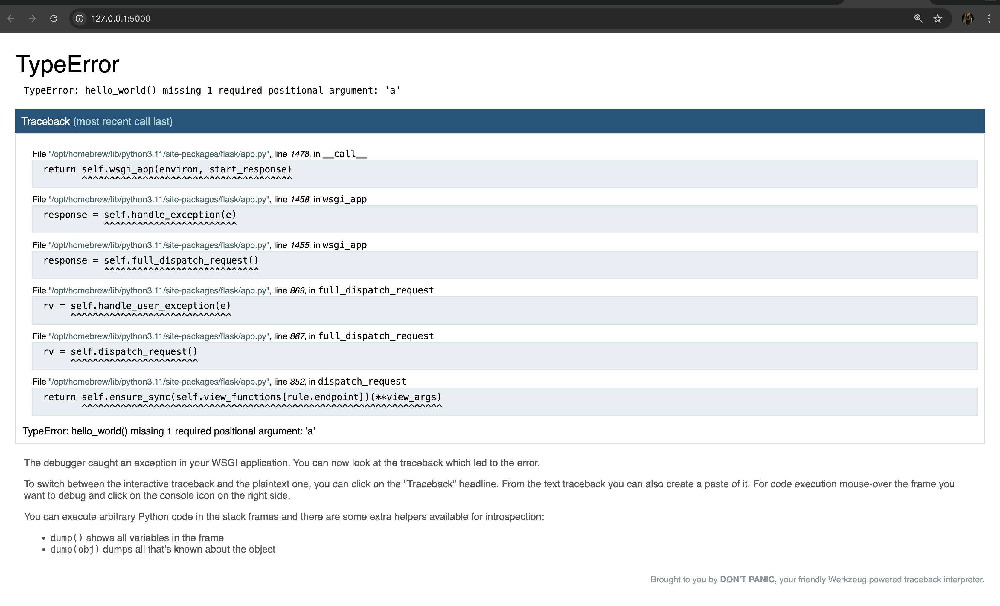

# Flask

## What is a Flask
Flask is a popular Python web framework, meaning it is a third-party Python library used for developing web applications.

Flask is a lightweight WSGI(Web Server Gateway Interface) web application framework. It is designed to make getting started quick and easy, with the ability to scale up to complex applications.

Flask depends on the Werkzeug WSGI toolkit, the Jinja template engine, and the Click CLI toolkit. Be sure to check their documentation as well as Flask’s when looking for information.

## Installation

### Python Version
recommended using the latest version of Python. Flask supports Python 3.9 and newer.

### Dependencies
These distributions will be installed automatically when installing Flask.

* `Werkzeug` implements WSGI, the standard Python interface between applications and servers.
* `Jinja` is a template language that renders the pages your application serves.
* `MarkupSafe` comes with Jinja. It escapes untrusted input when rendering templates to avoid injection attacks.
* `ItsDangerous` securely signs data to ensure its integrity. This is used to protect Flask’s session cookie.
* `Click` is a framework for writing command line applications. It provides the flask command and allows adding custom management commands.
* `Blinker` provides support for Signals.

### Optional dependencies
These distributions will not be installed automatically. Flask will detect and use them if you install them.

* python-dotenv enables support for Environment Variables From dotenv when running flask commands.
* Watchdog provides a faster, more efficient reloader for the development server.

### greenlet
You may choose to use gevent or eventlet with your application. In this case, greenlet>=1.0 is required. When using PyPy, PyPy>=7.3.7 is required.

These are not minimum supported versions, they only indicate the first versions that added necessary features. You should use the latest versions of each.

### Virtual environments
Use a virtual environment to manage the dependencies for your project, both in development and in production.

What problem does a virtual environment solve? The more Python projects you have, the more likely it is that you need to work with different versions of Python libraries, or even Python itself. Newer versions of libraries for one project can break compatibility in another project.

Virtual environments are independent groups of Python libraries, one for each project. Packages installed for one project will not affect other projects or the operating system’s packages.

Python comes bundled with the venv module to create virtual environments.

#### Create an environment
Create a project folder and a .venv folder within and Before you work on your project, activate the corresponding environment:

#### For MacOS/Linux
**Create an environment**
```sh
$ mkdir myproject
$ cd myproject
$ python3 -m venv .venv
```
**Activate the environment**
```sh
$ . .venv/bin/activate
```

#### For Windows
```cmd
> mkdir myproject
> cd myproject
> py -3 -m venv .venv
```

**Activate the environment**
```cmd
> .venv\Scripts\activate
```

Your shell prompt will change to show the name of the activated environment.

### Install Flask
Within the activated environment, use the following command to install Flask:

```sh
$ pip install Flask
```

## Quickstart
### A Minimal Application
A minimal Flask application looks something like this:

```py
from flask import Flask

app = Flask(__name__)

@app.route("/")
def hello_world():
    return "<p>Hello, World!</p>"
```

**So what did that code do?**

1. First we imported the `Flask class`. An instance of this class will be our `WSGI` application.

2. Next we create an instance of this class. The first argument is the name of the application’s module or package. `__name__` is a convenient shortcut for this that is appropriate for most cases. This is needed so that Flask knows where to look for resources such as templates and static files.

3. We then use the route() decorator to tell Flask what URL should trigger our function.

4. The function returns the message we want to display in the user’s browser. The default content type is HTML, so HTML in the string will be rendered by the browser.

Save it as hello.py or something similar. Make sure to not call your application flask.py because this would conflict with Flask itself.

To run the application, use the flask command or python -m flask. You need to tell the Flask where your application is with the --app option.

```sh
$ flask --app hello run
 * Serving Flask app 'hello'
 * Running on http://127.0.0.1:5000 (Press CTRL+C to quit)
```

> #### Application Discovery Behavior
> As a shortcut, if the file is named app.py or wsgi.py, you don’t have to use --app. See Command Line Interface for more details.

_This launches a very simple builtin server, which is good enough for testing but probably not what you want to use in production. For deployment options see Deploying to Production._

_Now head over to http://127.0.0.1:5000/, and you should see your hello world greeting._

_If another program is already using port 5000, you’ll see OSError: [Errno 98] or OSError: [WinError 10013] when the server tries to start. See Address already in use for how to handle that._


> Externally Visible Server
> If you run the server you will notice that the server is only accessible from your own computer, not from any other in the network. This is the default because in debugging mode a user of the application can execute arbitrary Python code on your computer.
> 
> If you have the debugger disabled or trust the users on your network, you can make the server publicly available simply by adding `--host=0.0.0.0` to the command line:
>```sh 
> $ flask run --host=0.0.0.0
>```
> This tells your operating system to listen on all public IPs.

### Debug Mode
The flask run command can do more than just start the development server. By enabling debug mode, the server will automatically reload if code changes, and will show an interactive debugger in the browser if an error occurs during a request.



> _Warning_
> The debugger allows executing arbitrary Python code from the browser. It is protected by a pin, but still represents a major security risk. Do not run the development server or debugger in a production environment.

To enable debug mode, use the --debug option.

```sh
$ flask --app hello run --debug
 * Serving Flask app 'hello'
 * Debug mode: on
 * Running on http://127.0.0.1:5000 (Press CTRL+C to quit)
 * Restarting with stat
 * Debugger is active!
 * Debugger PIN: nnn-nnn-nnn
```

See also:

* `Development Server` and Command Line Interface for information about running in debug mode.
* `Debugging Application` Errors for information about using the built-in debugger and other debuggers.
* `Logging` and `Handling Application` Errors to log errors and display nice error pages.

### HTML Escaping¶
When returning HTML (the default response type in Flask), any user-provided values rendered in the output must be escaped to protect from injection attacks. HTML templates rendered with Jinja, introduced later, will do this automatically.

`escape()`, shown here, can be used manually. It is omitted in most examples for brevity, but you should always be aware of how you’re using untrusted data.

If a user managed to submit the name <script>alert("bad")</script>, escaping causes it to be rendered as text, rather than running the script in the user’s browser.

<name> in the route captures a value from the URL and passes it to the view function. These variable rules are explained below.

### Routing
Modern web applications use meaningful URLs to help users. Users are more likely to like a page and come back if the page uses a meaningful URL they can remember and use to directly visit a page.

Use the route() decorator to bind a function to a URL.
```py
@app.route('/')
def index():
    return 'Index Page'

@app.route('/hello')
def hello():
    return 'Hello, World'
```
You can do more! You can make parts of the URL dynamic and attach multiple rules to a function.

### Variable Rules
You can add variable sections to a URL by marking sections with `<variable_name>`. Your function then receives the `<variable_name>` as a keyword argument. Optionally, you can use a converter to specify the type of the argument like `<converter:variable_name>`.
```py
from markupsafe import escape

@app.route('/user/<username>')
def show_user_profile(username):
    # show the user profile for that user
    return f'User {escape(username)}'

@app.route('/post/<int:post_id>')
def show_post(post_id):
    # show the post with the given id, the id is an integer
    return f'Post {post_id}'

@app.route('/path/<path:subpath>')
def show_subpath(subpath):
    # show the subpath after /path/
    return f'Subpath {escape(subpath)}'
```
***Converter types:***

| Type    | Description                              |
|---------|------------------------------------------|
| `string`| (default) Har qanday matnni qabul qiladi, lekin slashes (`/`) qabul qilmaydi. |
| `int`   | Musbat butun sonlarni qabul qiladi.      |
| `float` | Musbat o'nlik sonlarni qabul qiladi.     |
| `path`  | `string` kabi, lekin slashes (`/`) ham qabul qiladi. |
| `uuid`  | UUID formatidagi satrlarni qabul qiladi. |

### Unique URLs / Redirection Behavior
The following two rules differ in their use of a trailing slash.

```sh
@app.route('/projects/')
def projects():
    return 'The project page'

@app.route('/about')
def about():
    return 'The about page'
```
The canonical URL for the projects endpoint has a trailing slash. It’s similar to a folder in a file system. If you access the URL without a trailing slash (/projects), Flask redirects you to the canonical URL with the trailing slash (/projects/).

### URL Building
To build a URL to a specific function, use the url_for() function. It accepts the name of the function as its first argument and any number of keyword arguments, each corresponding to a variable part of the URL rule. Unknown variable parts are appended to the URL as query parameters.

Why would you want to build URLs using the URL reversing function url_for() instead of hard-coding them into your templates?

1. Reversing is often more descriptive than hard-coding the URLs.

2. You can change your URLs in one go instead of needing to remember to manually change hard-coded URLs.

3. URL building handles escaping of special characters transparently.

4. The generated paths are always absolute, avoiding unexpected behavior of relative paths in browsers.

5. If your application is placed outside the URL root, for example, in /myapplication instead of /, url_for() properly handles that for you.

For example, here we use the test_request_context() method to try out url_for(). test_request_context() tells Flask to behave as though it’s handling a request even while we use a Python shell. See Context Locals.

```py
from flask import url_for

@app.route('/')
def index():
    return 'index'

@app.route('/login')
def login():
    return 'login'

@app.route('/user/<username>')
def profile(username):
    return f'{username}\'s profile'

with app.test_request_context():
    print(url_for('index'))
    print(url_for('login'))
    print(url_for('login', next='/'))
    print(url_for('profile', username='John Doe'))
```

```txt
/
/login
/login?next=/
/user/John%20Doe
```

### HTTP Methods
Web applications use different HTTP methods when accessing URLs. You should familiarize yourself with the HTTP methods as you work with Flask. By default, a route only answers to GET requests. You can use the methods argument of the route() decorator to handle different HTTP methods.
```py
from flask import request

@app.route('/login', methods=['GET', 'POST'])
def login():
    if request.method == 'POST':
        return do_the_login()
    else:
        return show_the_login_form()
```

The example above keeps all methods for the route within one function, which can be useful if each part uses some common data.

You can also separate views for different methods into different functions. Flask provides a shortcut for decorating such routes with get(), post(), etc. for each common HTTP method.
```py
@app.get('/login')
def login_get():
    return show_the_login_form()

@app.post('/login')
def login_post():
    return do_the_login()
```

If GET is present, Flask automatically adds support for the HEAD method and handles HEAD requests according to the HTTP RFC. Likewise, OPTIONS is automatically implemented for you.

### Static Files
Dynamic web applications also need static files. That’s usually where the CSS and JavaScript files are coming from. Ideally your web server is configured to serve them for you, but during development Flask can do that as well. Just create a folder called static in your package or next to your module and it will be available at /static on the application.

To generate URLs for static files, use the special 'static' endpoint name:
```py
url_for('static', filename='style.css')
```
The file has to be stored on the filesystem as static/style.css.

### Rendering Templates

Generating HTML from within Python is not fun, and actually pretty cumbersome because you have to do the HTML escaping on your own to keep the application secure. Because of that Flask configures the Jinja2 template engine for you automatically.

Templates can be used to generate any type of text file. For web applications, you’ll primarily be generating HTML pages, but you can also generate markdown, plain text for emails, and anything else.

For a reference to HTML, CSS, and other web APIs, use the MDN Web Docs.

To render a template you can use the render_template() method. All you have to do is provide the name of the template and the variables you want to pass to the template engine as keyword arguments. Here’s a simple example of how to render a template:

```py
from flask import render_template

@app.route('/hello/')
@app.route('/hello/<name>')
def hello(name=None):
    return render_template('hello.html', person=name)
```
Flask will look for templates in the templates folder. So if your application is a module, this folder is next to that module, if it’s a package it’s actually inside your package:

**Case 1:** a module:
```arch
/application.py
/templates
    /hello.html
```

**Case 2:** a package:
```
/application
    /__init__.py
    /templates
        /hello.html
```

For templates you can use the full power of Jinja2 templates. Head over to the official Jinja2 Template Documentation for more information.

Here is an example template:
```html
<!doctype html>
<title>Hello from Flask</title>

  <h1>Hello {{ person }}!</h1>

  <h1>Hello, World!</h1>

```
Inside templates you also have access to the `config, request, session` and g^[1] objects as well as the `url_for()` and `get_flashed_messages()` functions.

Templates are especially useful if inheritance is used. If you want to know how that works, see Template Inheritance. Basically template inheritance makes it possible to keep certain elements on each page (like header, navigation and footer).

Automatic escaping is enabled, so if person contains HTML it will be escaped automatically. If you can trust a variable and you know that it will be safe HTML (for example because it came from a module that converts wiki markup to HTML) you can mark it as safe by using the Markup class or by using the |safe filter in the template. Head over to the Jinja 2 documentation for more examples.

Here is a basic introduction to how the Markup class works:

```Markup
>>> from markupsafe import Markup
>>> Markup('<strong>Hello %s!</strong>') % '<blink>hacker</blink>'
>>> Markup('<strong>Hello &lt;blink&gt;hacker&lt;/blink&gt;!</strong>')
>>> Markup.escape('<blink>hacker</blink>')
Markup('&lt;blink&gt;hacker&lt;/blink&gt;')
Markup('<em>Marked up</em> &raquo; HTML').striptags()
'Marked up » HTML'
```

> _Changelog:_ <br>
> _Changed in version 0.5: Autoescaping is no longer enabled for all templates. The following extensions for templates trigger autoescaping: .html, .htm, .xml, .xhtml. Templates loaded from a string will have autoescaping disabled._

Unsure what that g object is? It’s something in which you can store information for your own needs. See the documentation for flask.g and Using SQLite 3 with Flask.

### Accessing Request Data
